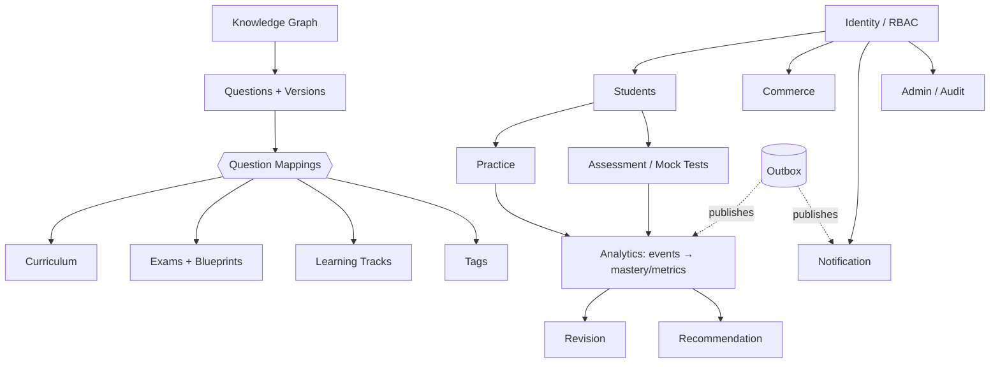

# DATABASE_ERD.md — Phase 2

Entity-relationship diagrams (Mermaid). Rendered automatically by GitHub/most Markdown viewers. Split by cluster for readability; the schema of record is [`schema.prisma`](apps/api/prisma/schema.prisma).

---

## 0. Domain map (high level)



## 1. Identity & Access

```mermaid
erDiagram
  ORGANIZATIONS ||--o{ USERS : "scopes (soft)"
  USERS ||--o{ USER_ROLES : has
  ROLES ||--o{ USER_ROLES : grants
  ROLES ||--o{ ROLE_PERMISSIONS : has
  PERMISSIONS ||--o{ ROLE_PERMISSIONS : in
  USERS ||--o{ REFRESH_TOKENS : owns
  USERS ||--o{ EMAIL_VERIFICATION_TOKENS : owns
  USERS ||--o{ PASSWORD_RESET_TOKENS : owns
  USERS ||--o| STUDENT_PROFILES : has
  USERS ||--o| STUDENT_PREFERENCES : has
  USERS ||--o{ STUDENT_GOALS : sets

  USERS { uuid id PK; uuid organizationId FK; string email; enum status }
  ROLES { uuid id PK; string name }
  PERMISSIONS { uuid id PK; string key }
  REFRESH_TOKENS { uuid id PK; uuid familyId; string tokenHash }
```

## 2. Knowledge, Question & Mappings (core — the Golden Rule)

```mermaid
erDiagram
  KNOWLEDGE_NODES ||--o{ KNOWLEDGE_EDGES : "parent"
  KNOWLEDGE_NODES ||--o{ KNOWLEDGE_EDGES : "child"
  QUESTIONS ||--o{ QUESTION_VERSIONS : "has versions"
  QUESTION_VERSIONS ||--o| QUESTIONS : "is current of"
  QUESTION_VERSIONS ||--o{ QUESTION_OPTIONS : has
  QUESTION_VERSIONS ||--o{ QUESTION_MEDIA : has
  QUESTIONS ||--o{ QUESTION_KNOWLEDGE_MAPPING : maps
  KNOWLEDGE_NODES ||--o{ QUESTION_KNOWLEDGE_MAPPING : maps
  QUESTIONS ||--o{ QUESTION_EXAM_MAPPING : maps
  QUESTIONS ||--o{ QUESTION_CURRICULUM_MAPPING : maps
  QUESTIONS ||--o{ QUESTION_TRACK_MAPPING : maps
  QUESTIONS ||--o{ QUESTION_TAG_MAPPING : maps
  TAGS ||--o{ QUESTION_TAG_MAPPING : maps

  QUESTIONS { uuid id PK; string questionCode; enum questionType; enum status; uuid currentVersionId FK; string normalizedTextHash }
  QUESTION_VERSIONS { uuid id PK; int versionNumber; string questionText; json answerSpec; string normalizedTextHash }
  KNOWLEDGE_NODES { uuid id PK; string code; string type }
  KNOWLEDGE_EDGES { uuid id PK; enum relationshipType }
```

> Note the absence of any FK from `QUESTIONS` to exams/curriculums/tracks — only mapping tables. That is the Golden Rule made physical.

## 3. Curriculum · Exam · Learning

```mermaid
erDiagram
  CURRICULUMS ||--o{ CURRICULUM_NODES : contains
  CURRICULUM_NODES ||--o{ CURRICULUM_NODES : "parent/child"
  CURRICULUM_NODES ||--o{ CURRICULUM_KNOWLEDGE_MAPPING : maps
  KNOWLEDGE_NODES ||--o{ CURRICULUM_KNOWLEDGE_MAPPING : maps

  EXAM_PROFILES ||--o{ EXAM_BLUEPRINTS : has
  EXAM_BLUEPRINTS ||--o{ EXAM_BLUEPRINT_ITEMS : weights
  EXAM_PROFILES ||--o{ EXAM_KNOWLEDGE_MAPPING : maps
  KNOWLEDGE_NODES ||--o{ EXAM_KNOWLEDGE_MAPPING : maps

  LEARNING_TRACKS ||--o{ TRACK_MODULES : has
  TRACK_MODULES ||--o{ TRACK_KNOWLEDGE_MAPPING : maps
  TRACK_MODULES ||--o{ TRACK_PROGRESS : tracked

  EXAM_BLUEPRINTS { uuid id PK; int totalQuestions }
  EXAM_BLUEPRINT_ITEMS { uuid id PK; float weightPercent; int questionCount }
```

## 4. Practice & Assessment (§7-B)

```mermaid
erDiagram
  USERS ||--o{ PRACTICE_SESSIONS : runs
  PRACTICE_SESSIONS ||--o{ PRACTICE_SESSION_QUESTIONS : serves
  PRACTICE_SESSIONS ||--o{ PRACTICE_ANSWERS : records
  QUESTIONS ||--o{ PRACTICE_SESSION_QUESTIONS : in

  EXAM_PROFILES ||--o{ MOCK_TESTS : "defines"
  EXAM_BLUEPRINTS ||--o{ MOCK_TESTS : "generates"
  MOCK_TESTS ||--o{ MOCK_TEST_QUESTIONS : "fixed set"
  MOCK_TESTS ||--o{ TEST_SESSIONS : "attempted by (cohort)"
  USERS ||--o{ TEST_SESSIONS : attempts
  TEST_SESSIONS ||--o{ TEST_QUESTION_SNAPSHOTS : freezes
  TEST_SESSIONS ||--o{ TEST_ANSWERS : records
  TEST_QUESTION_SNAPSHOTS ||--o{ TEST_ANSWERS : answered
  TEST_SESSIONS ||--o| RESULTS : scored

  MOCK_TESTS { uuid id PK; enum mode; int totalQuestions; enum status }
  TEST_SESSIONS { uuid id PK; uuid mockTestId FK "nullable=ad-hoc" }
  TEST_QUESTION_SNAPSHOTS { uuid id PK; json snapshot "immutable" }
  RESULTS { uuid id PK; float score; int rank; float percentile }
```

## 5. Analytics · Revision · Recommendation · Commerce · Ops

```mermaid
erDiagram
  USERS ||--o{ REVISION_QUEUE : queued
  QUESTIONS ||--o{ REVISION_QUEUE : about
  USERS ||--o{ BOOKMARKS : saves
  USERS ||--o{ STUDENT_MASTERY : measured
  KNOWLEDGE_NODES ||--o{ STUDENT_MASTERY : per
  KNOWLEDGE_NODES ||--o| TOPIC_METRICS : aggregates
  QUESTIONS ||--o| QUESTION_METRICS : aggregates

  USERS ||--o{ SUBSCRIPTIONS : holds
  PLANS ||--o{ PLAN_PRICES : priced
  PLANS ||--o{ PLAN_FEATURES : grants
  FEATURES ||--o{ PLAN_FEATURES : in
  PLANS ||--o{ SUBSCRIPTIONS : on
  SUBSCRIPTIONS ||--o{ PAYMENTS : billed
  USERS ||--o{ PAYMENTS : pays
  USERS ||--o{ NOTIFICATIONS : receives
  RECOMMENDATION_RULES ||--o{ RECOMMENDATION_HISTORY : produces

  EVENTS { uuid id PK; string type; timestamptz occurredAt }
  OUTBOX_EVENTS { uuid id PK; enum status; timestamptz availableAt }
  AUDIT_LOGS { uuid id PK; string action "append-only" }
  PAYMENTS { uuid id PK; int amountMinor; string idempotencyKey }
```

> `EVENTS`, `OUTBOX_EVENTS`, and `AUDIT_LOGS` have no hard FKs (soft refs) — high-volume / append-only tables kept decoupled.
